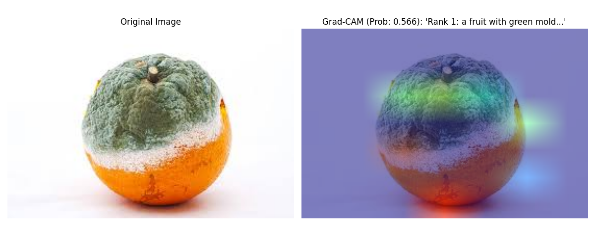
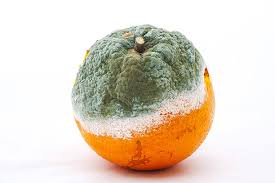
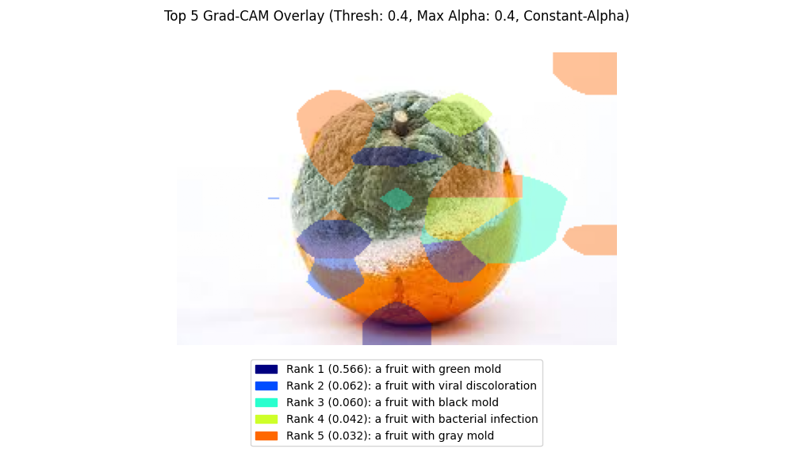
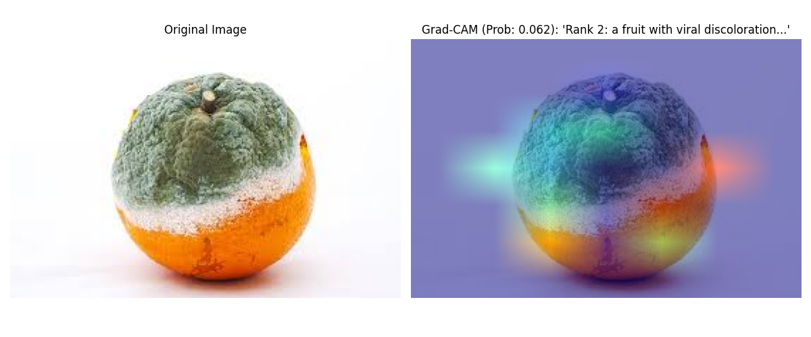
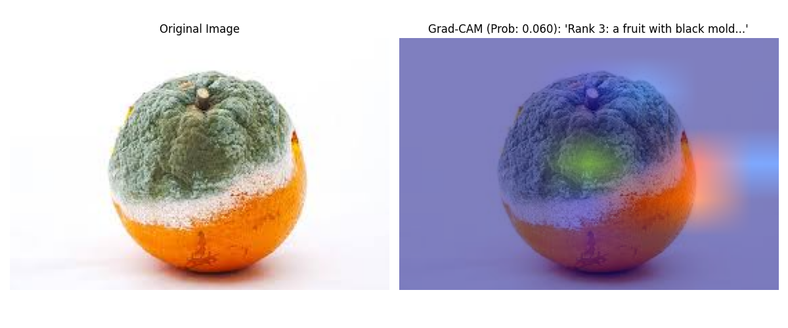
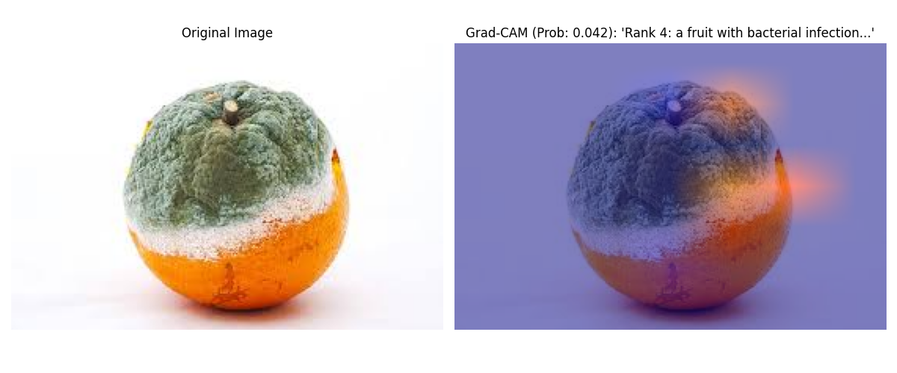
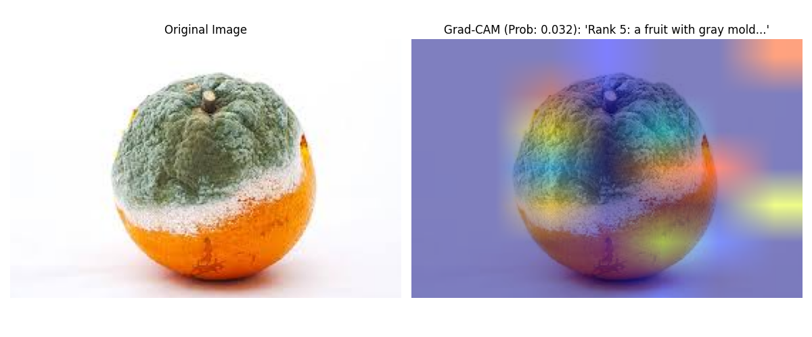

## CLIP-Captioner with Grad-CAM Explainability

This repository contains a Vision-Language Model (VLM) for image captioning based on CLIP prefixes (ClipCap-style) with an emphasis on practical explainability using Grad-CAM over CLIP's visual transformer. The system pairs CLIP as the vision backbone and OPT-125M as the language model, bridged by a transformer mapper that projects CLIP image features into a sequence of prefix tokens consumed by the language model. Explainability visualizations highlight where the model focused when preferring one caption over another. A core contribution of this work is an automatic dataset labeling pipeline driven by CLIP: the model synthesizes training captions from top-k prompt probabilities and uses them to train the captioner end-to-end without manual labels.

This project is part of a research fellowship on the theme of "Digital Twin and Fintech services for sustainable supply chain" and part of my Master Thesis. The core objective is to find, identify, and explain—both visually and textually—defective items within a supply chain environment.



## How it works (core idea)

1) Visual understanding with CLIP (frozen)
   - CLIP encodes the input image into a 512-d feature vector (image embedding). On the text side, a domain-specific prompt set (in `utils/knowledge.py`) is tokenized once and cached.
   - CLIP produces a probability distribution over the prompts (e.g., kinds of fruit diseases/damage/aging). These probabilities guide both caption generation (as priors) and explainability.

2) Mapping image features to language tokens (TransformerMapper)
   - The 512-d image embedding is lifted by `TransformerMapper` into a sequence of `prefix_length` vectors, each with dimensionality matching OPT-125M’s token embeddings.
   - These vectors act as “virtual tokens” prepended to the textual prompt (`prefix_text`). This is the ClipCap intuition: inject vision information as a learned prefix so the LM continues in natural language space without modifying the LM itself.

3) Language generation with OPT-125M (decoder-only)
   - OPT receives: [mapped visual prefix tokens] + [tokenized `prefix_text`]. It then autoregressively generates tokens using temperature/top-k/top-p sampling, with early-EOS avoidance until a desired `min_length` is reached.
   - The final decoded string is post-processed to remove the guiding `prefix_text` so only the caption content remains.

4) Auto-labeling with CLIP (dataset creation)
   - We automatically label the dataset using CLIP: for each image, CLIP ranks the domain prompts and we synthesize a natural-language caption from the top-k (see `utils/summarizer.py`).
   - We persist (a) the CLIP image embedding (`*.pt`) and (b) the synthesized caption into a training corpus (`caption_mapping.csv`). This step eliminates manual labeling and scales cheaply.

5) Training on generated labels (teacher forcing)
   - Using the auto-labeled corpus, we feed ground-truth (synthesized) caption tokens plus the mapped visual prefix to OPT and minimize next-token cross-entropy.
   - Only the mapper and LM are trained; CLIP remains frozen. Checkpoints include model and optimizer states for reproducibility.

6) Explainability with Grad-CAM over CLIP’s ViT
   - For the top-k prompts, we compute Grad-CAM maps on a chosen transformer block in CLIP’s visual encoder by registering forward/backward hooks to capture activations and gradients.
   - For each prompt, we backprop from the image–prompt matching score to get a spatial saliency map over image patches, then upsample to image size.
   - Visualizations include: (a) individual overlays per prompt (with the prompt’s probability), and (b) a combined overlay where per-prompt alpha can be constant or scaled by normalized probabilities. Thresholding controls which regions are visualized, and a legend ties color to prompt and probability.

The application is run via a Gradio interface launched by `launch.py`. After training and having a checkpoint available, users can upload images, generate captions, and view explanation maps directly in the browser.

### Key highlights
- **ClipCap-style captioning**: Generates captions by conditioning a decoder-only LM (OPT-125M) on CLIP-derived prefix tokens.
- **Grad-CAM explainability**: Pixel-level overlays explain why top candidate captions are favored, with options for combined and individual maps and probability-aware alpha scaling.
- **CLIP-based auto-labeling pipeline**: Converts raw image folders into CLIP embeddings and synthesized captions (from top-k prompt probabilities), enabling training without manual labels.
- **Training loop and checkpointing**: Train the mapper+LM end-to-end on precomputed embeddings and captions, with periodic checkpoint saves.
- **Interactive Gradio app**: Upload an image, tune generation/visualization parameters, and see the caption plus attention overlays.


### Why auto-labeling matters

- Benefits
  - Scales labeling to large image collections without manual annotation.
  - Produces consistent, domain-aligned captions from a curated prompt set.
  - Rapidly bootstraps a training corpus to fine-tune a captioner on a niche domain.
  - Enables iterative refinement: update prompts → regenerate labels → retrain.

- Considerations
  - Label quality depends on the prompt set and CLIP’s domain coverage; poor prompts lead to noisier captions.
  - Synthesized captions may bias wording; periodic human review is recommended for critical deployments.
  - For best results, maintain prompts to match your dataset’s actual phenomena and vocabulary.


## Repository structure

```text
FINAL_TESI/
  models/
    clip.py           # CLIP wrapper: preprocessing, inference, Grad-CAM, preprocessing pipeline
    mapper.py         # TransformerMapper projecting CLIP features to LM embedding space
    vlm.py            # ClipCaptioner: OPT-125M + CLIP wrapper + training/inference logic
  utils/
    data.py           # Training dataset built from preprocessed embeddings/captions
    knowledge.py      # Prompt set (domain knowledge) for CLIP text side
    plot.py           # Helpers to render individual and combined Grad-CAM overlays
    summarizer.py     # Synthesize a natural caption from top caption-probability pairs
  launch.py      # Gradio app for interactive captioning + Grad-CAM visualization
  vlm_train.py        # Script: preprocess dataset and train the VLM
  vlm_predict.py      # Test script: load VLM checkpoint and run captioning + visualizations
  clip_predict.py     # Test script: CLIP-only demo (after training, for quick checks)
```

### Files explained

- `launch.py`
  - Launches the Gradio UI (main entry point).
  - Loads a trained checkpoint (`MODEL_PATH`) into `ClipCaptioner`.
  - Exposes controls for caption generation (temperature, prefix text, lengths) and explainability (alpha, normalization).
  - On submit: saves a temp image, calls `model.generate`, and returns combined + individual Grad-CAM overlays, top-5 probabilities, and the final caption.

- `vlm_train.py`
  - Demonstrates end-to-end training flow:
    1) `ClipCaptioner.preprocess_dataset`: walks a class-structured folder, computes CLIP embeddings and synthesized captions, writes `*.pt` and `caption_mapping.csv`.
    2) `ClipCaptioner.train_model`: trains the OPT-125M + TransformerMapper using teacher-forced captions; logs loss and saves periodic checkpoints.
  - Edit `root_dir`, `processed_dir`, `output_dir` before running.

- `vlm_predict.py`
  - Loads a trained VLM checkpoint and runs `ClipCaptioner.generate(image=...)`.
  - Saves the combined overlay and individual Grad-CAM overlays.
  - Prints the generated caption and full caption-probability dictionary.

- `clip_predict.py`
  - Minimal CLIP-only demo using `CLIPW`.
  - Computes probabilities over the prompt set (`utils/knowledge.py`), extracts top-k predictions, and synthesizes a caption via `utils/summarizer.synthesize`.
  - Useful sanity-check for the CLIP side after training.

- `models/vlm.py` (class `ClipCaptioner`)
  - Core VLM that combines:
    - OPT-125M (decoder-only LM) with tokenizer and embeddings.
    - `TransformerMapper` to project CLIP image features to a `prefix_length × embedding_dim` prefix sequence.
    - `CLIPW` wrapper instance for image processing, top-k prompt probabilities, and Grad-CAM maps.
  - Key methods:
    - `forward(tokens, prefix, mask=None, labels=None)`: concatenates prefix projections with token embeddings and forwards through OPT.
    - `preprocess_dataset(root_dir, output_dir, batch_size)`: delegates to `CLIPW` to build a training dataset from raw images.
    - `get_visual_explanation(image, ...)`: returns Grad-CAM outputs via `CLIPW.visualize`.
    - `generate(image, ..., k, plot_individual, combined_threshold, combined_alpha, normalize_alpha_scaling)`: full inference path returning probabilities dict, final caption, combined and individual overlays.
    - `train_model(dataset_path, output_dir, epochs, ...)`: training loop with logging, scheduler, and checkpointing.
    - `from_pretrained(model_path)`: load a previously saved checkpoint.

- `models/clip.py` (class `CLIPW`)
  - Thin, high-level wrapper around OpenAI CLIP for:
    - Image preprocessing and encoding.
    - Prompt tokenization and caching.
    - Probability computation over prompts and `top_k` extraction.
    - Dataset preprocessing: export CLIP embeddings (`*.pt`) + synthesized captions (`caption_mapping.csv`).
    - Grad-CAM generation over CLIP’s visual transformer for the top-k prompts, with:
      - Per-prompt overlays (`individual_map`) and a probability-aware combined overlay (`combined_map`).
  - Accepts images as file paths, PIL images, or NumPy arrays (cv2). Handles dtype conversions and device management.

- `models/mapper.py` (class `TransformerMapper`)
  - Projects a 512-d CLIP image embedding (optionally batched) to LM embedding space using:
    - Linear projection → TransformerEncoder (N layers, multi-head attention) → Linear projection → LayerNorm.
  - Outputs a flattened sequence that is reshaped into `prefix_length` tokens to be concatenated with LM token embeddings.

- `utils/data.py` (class `Dataset`)
  - Consumes a preprocessed directory containing `caption_mapping.csv` and `*.pt` embeddings.
  - Returns `(embedding_tensor, caption_string)` pairs for training.

- `utils/knowledge.py`
  - Domain prompt set for CLIP under `captions["fruits"]` covering diseases, texture, damage, and aging cues.
  - Extend this list to adapt the system to new domains.

- `utils/plot.py`
  - `individual_map(original_img, cam_map, caption, probability)`: returns a two-panel PIL image (original + overlay) with optional probability in title.
  - `combined_map(original_img, captions, cam_maps, probabilities_for_alpha, original_probabilities, k, threshold, alpha, normalize_alpha_scaling)`: returns a PIL image overlay with a legend and probability-aware alpha scaling.

- `utils/summarizer.py`
  - `synthesize(captions_with_probabilities)`: converts top-k (caption, probability) into a natural sentence using a severity hierarchy.


## Method overview

- **Vision encoder (CLIP, frozen)**
  - Encodes image; evaluates similarity to cached text prompts; outputs probabilities used for priors and XAI.
  - Wrapper (`models/clip.py`) handles preprocessing, batching, top-k selection, Grad-CAM generation, and dataset preprocessing.

- **Transformer mapper (learned)**
  - `models/mapper.py` lifts CLIP embeddings into a sequence of `prefix_length` vectors in LM embedding space via Linear → TransformerEncoder (N layers) → Linear → LayerNorm.

- **Language model (OPT-125M, learned)**
  - Receives mapped visual prefix + text tokens and learns to continue the caption. Teacher forcing during training; sampling at inference.

- **Data pipeline**
  - `CLIPW.preprocess_dataset` → `.pt` embeddings + `caption_mapping.csv` with synthesized captions → `utils/data.Dataset` → `DataLoader`.

- **Training and checkpoints**
  - `ClipCaptioner.train_model` handles loop, logging, scheduler; `save_pretrained` persists model/optimizer/epoch/loss.

- **Inference + XAI**
  - `ClipCaptioner.generate` returns `(probs_dict, caption, combined_plot_PIL, [individual_plot_PILs])` with configurable sampling and Grad-CAM controls.


## Installation

Prerequisites:
- Python 3.10+ (tested with 3.12)
- PyTorch (CUDA recommended)
- `openai-clip` (`clip`), `transformers`, `gradio`, `tqdm`, `pandas`, `matplotlib`, `opencv-python`, `Pillow`, `numpy`

Example setup (conda or venv is recommended):

```bash
python -m venv .venv
source .venv/bin/activate
pip install --upgrade pip
pip install torch torchvision torchaudio --index-url https://download.pytorch.org/whl/cu121  # adjust for your CUDA
pip install git+https://github.com/openai/CLIP.git
pip install transformers gradio tqdm pandas matplotlib opencv-python Pillow numpy
```


## Quickstart

1) Preprocess and train (adjust paths):

```python
from models.vlm import ClipCaptioner

root_dir = "/path/to/raw_dataset"
processed_dir = "/path/to/processed_dataset"
output_dir = "/path/to/checkpoints"

model = ClipCaptioner()
model.preprocess_dataset(root_dir=root_dir, output_dir=processed_dir, batch_size=32)
model.train_model(dataset_path=processed_dir, output_dir=output_dir, epochs=10, batch_size=32)
```

2) Launch the Gradio app (point to your checkpoint):

```bash
python launch.py
```

Edit `MODEL_PATH` at the top of `launch.py` (e.g., `train/checkpoints/clipcap_epoch_9.pt`). Upload an image in the UI to generate a caption and view Grad-CAM overlays.


## Data preparation

Your raw dataset should be class-structured (any labels you have), e.g.:

```text
root_dir/
  ClassA/
    img1.jpg
    img2.png
  ClassB/
    img3.jpg
    ...
```

Use the CLIP wrapper’s preprocessing to build an embedding+caption dataset:

```python
from models.vlm import ClipCaptioner

root_dir = "/path/to/raw_dataset"
processed_dir = "/path/to/processed_dataset"  # will contain *.pt + caption_mapping.csv

model = ClipCaptioner()
model.preprocess_dataset(root_dir=root_dir, output_dir=processed_dir, batch_size=32)
```

Artifacts in `processed_dir`:
- `emb_XXXXXXXX.pt` files for each image (CLIP image features)
- `caption_mapping.csv` mapping embedding IDs to synthesized captions
- `failed_images.txt` (optional) with any images that failed preprocessing


## Training

Quick-start via `vlm_train.py` (edit paths in the file):

```python
from models.vlm import ClipCaptioner

root_dir = "/path/to/raw_dataset"
processed_dir = "/path/to/processed_dataset"
output_dir = "/path/to/checkpoints"

model = ClipCaptioner(prefix_length=10, clip_length=512, hidden_size=768, num_layers=8, num_heads=8)
model.preprocess_dataset(root_dir=root_dir, output_dir=processed_dir, batch_size=32)
model.train_model(dataset_path=processed_dir, output_dir=output_dir, epochs=10, batch_size=32)
```

Training log and checkpoints are saved under `output_dir/` (e.g., `clipcap_epoch_9.pt`). Checkpoints store model and optimizer state.


## Inference (test scripts)

After you have trained the model and produced a checkpoint, you can use the test scripts to validate components individually:

- `vlm_predict.py`: loads a VLM checkpoint and generates a caption plus Grad-CAM visualizations for a single image.
- `clip_predict.py`: runs CLIP-only scoring and synthesized captioning from prompts (useful for quick checks of the CLIP side).

Example (`vlm_predict.py`):

```python
from models.vlm import ClipCaptioner

model_path = "train/checkpoints/clipcap_epoch_9.pt"  # update path
model = ClipCaptioner().from_pretrained(model_path)

img_path = "test_img.jpg"
probs, caption, combined_plot, individual_plots = model.generate(
    image=img_path,
    combined_alpha=0.4,
)

# Save visuals
import os
os.makedirs("results/vlm_predict", exist_ok=True)
combined_plot.save("results/vlm_predict/combined_plot.png")
for i, plot in enumerate(individual_plots):
    plot.save(f"results/vlm_predict/individual_plot_{i}.png")

print("Caption:", caption)
print("All probabilities:", probs)
```


## Interactive demo (Gradio)

Launch the Gradio UI in `launch.py` (this is the main application entry point). Edit the `MODEL_PATH` at the top if needed:

```bash
python launch.py
```

UI features:
- Upload an image
- Tune generation parameters: prefix text, temperature, max length, top-k/top-p (internally), min length
- Tune visualization parameters: combined alpha, enable normalization of alpha by top-k probabilities
- See: combined overlay, per-caption overlays, top-5 caption probabilities, and the generated caption

By default, the demo attempts to load `train/checkpoints/clipcap_epoch_9.pt` and enables `share=True` to expose a temporary public URL.


## Explainability controls

The `CLIPW.visualize` API (used by `ClipCaptioner.generate`) supports:
- **k**: number of top captions to visualize (k=1 → single map; k>1 → combined + optional individuals)
- **plot_individual**: save individual Grad-CAM overlays for each rank
- **combined_threshold**: minimum CAM value for a pixel to be shown in the combined overlay
- **combined_alpha**: maximum overlay alpha
- **normalize_alpha_scaling**: if True, scale per-caption alpha by normalized probabilities; if False, use constant alpha

Returned objects from `generate(image=...)`:
- `probs`: dict mapping candidate captions to probabilities
- `caption`: generated caption (prefix text removed)
- `combined_plot`: a PIL image with the combined overlay
- `individual_plots`: list of PIL images for per-caption overlays


## Domain prompts (knowledge base)

The CLIP text prompts live in `utils/knowledge.py` under the `captions["fruits"]` list (diseases, damage, aging cues, texture, etc.). You can extend or change these prompts to adapt to different domains. The wrapper caches tokenized prompts for efficiency.


## Tips and notes

- Checkpoint path defaults are placeholders in scripts (`train/checkpoints/clipcap_epoch_9.pt`). Update paths to your environment.
- OPT-125M and CLIP are downloaded from Hugging Face and OpenAI CLIP respectively at first run.
- GPU is strongly recommended. The code auto-detects CUDA; mixed precision is not forced.
- Training reads `.pt` embeddings and `caption_mapping.csv` generated by the preprocessing step; make sure paths align.


## Known limitations

- The quality of synthesized training captions depends on the domain prompt set.
- Grad-CAM over CLIP’s ViT provides intuitive saliency but is not a full causal explanation.
- Very long images or unusual aspect ratios may yield non-perfect square patch grids; a warning is logged and visualization still proceeds.


## References

- ClipCap: “ClipCap: CLIP Prefix for Image Captioning” — Mokady, Hertz, and Bermano.
- CLIP: “Learning Transferable Visual Models From Natural Language Supervision” — Radford et al.
- OPT: “OPT: Open Pre-trained Transformer Language Models” — Meta AI.

BibTeX for ClipCap:

```bibtex
@misc{mokady2021clipcapclipprefiximage,
      title={ClipCap: CLIP Prefix for Image Captioning}, 
      author={Ron Mokady and Amir Hertz and Amit H. Bermano},
      year={2021},
      eprint={2111.09734},
      archivePrefix={arXiv},
      primaryClass={cs.CV},
      url={https://arxiv.org/abs/2111.09734}, 
}
```


## Citation

If you use this repository, please cite the original works above and acknowledge this implementation:

```bibtex
@software{clip_captioner_gradcam_thesis,
  title        = {CLIP-Captioner with Grad-CAM Explainability},
  author       = {Hauber, Gabriele},
  year         = {2025},
  url          = {https://github.com/<your-username>/<your-repo>}
}
```


## License

Add your chosen license here (e.g., MIT). Ensure compatibility with CLIP and OPT model licenses.

## Gallery (media)

Images below are examples generated by the model. Replace or extend with your own results.

```text
Media folder: FINAL_TESI/media/
  - source_img.jpg
  - combined_plot.png
  - individual_plot_0.png
  - individual_plot_1.png
  - individual_plot_2.png
  - individual_plot_3.png
  - individual_plot_4.png
```

Preview:

<div style="display: flex; gap: 8px; align-items: flex-start;">
  <figure style="margin: 0;">
    
    <figcaption style="text-align:center; font-size: 12px;">Source image</figcaption>
  </figure>
  <figure style="margin: 0;">
    
    <figcaption style="text-align:center; font-size: 12px;">Combined Grad-CAM overlay</figcaption>
  </figure>
  
</div>

<div style="height: 8px;"></div>

<div style="display: flex; gap: 8px; flex-wrap: wrap;">
  
  
  
  
  
</div>

## Video demo

Short demo of the Gradio app flow:

<video src="media/video.mp4" width="300" controls></video>


